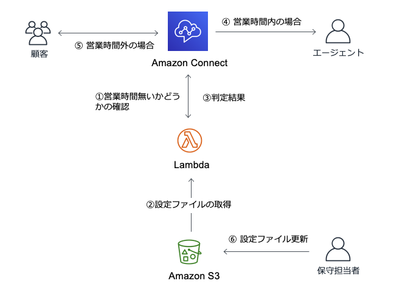
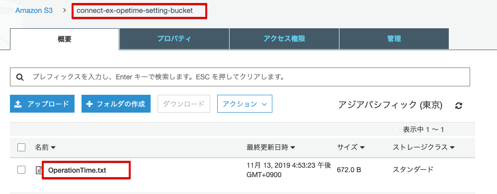

# AmazonConnectExtension001




```
$ cd cdk
$ npm run build
$ cdk synth
$ cdk bootstrap  <= 当該アカウント（リージョン）で初めて利用する場合
$ cdk deploy
$ cd ..
```


deployの出力からS3バケット名とLambdaのARNをコピーする

```
Outputs:
AmazonConnectExtension001Stack.SettingBucket = connect-ex-opetime-setting-bucket
AmazonConnectExtension001Stack.LambdaFunction = arn:aws:lambda:ap-northeast-1:xxxxxxxxxxxx:function:connect-ex-opetime-function
````

設定ファイルのアップロード

sample/OperationTime.txt

